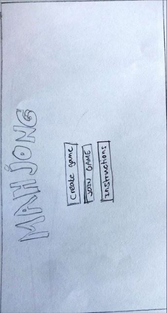
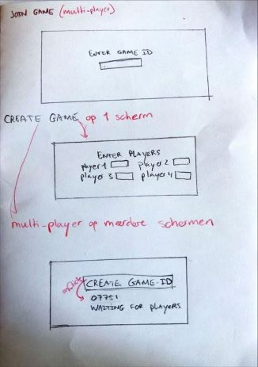
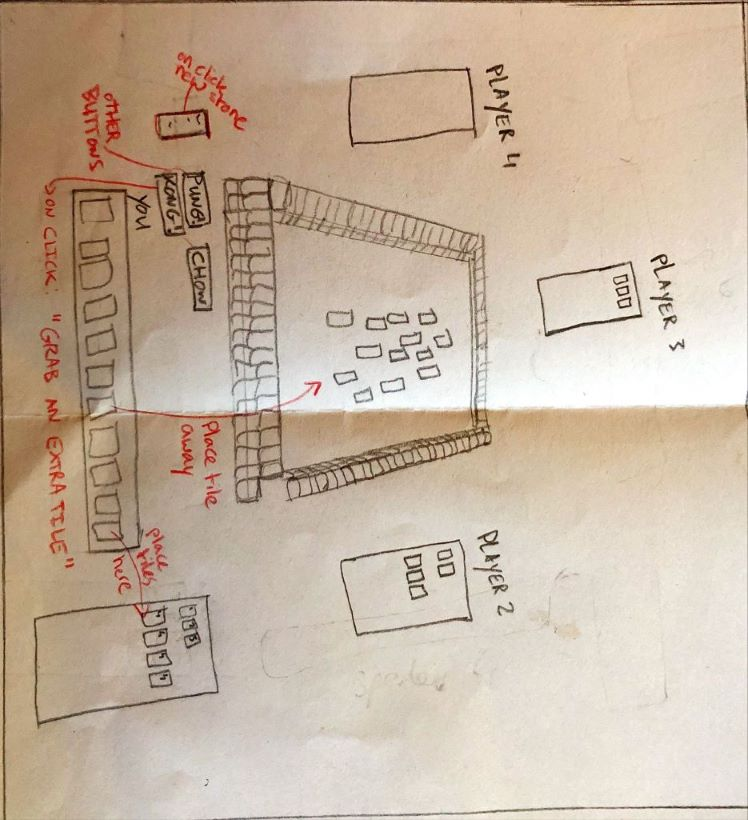
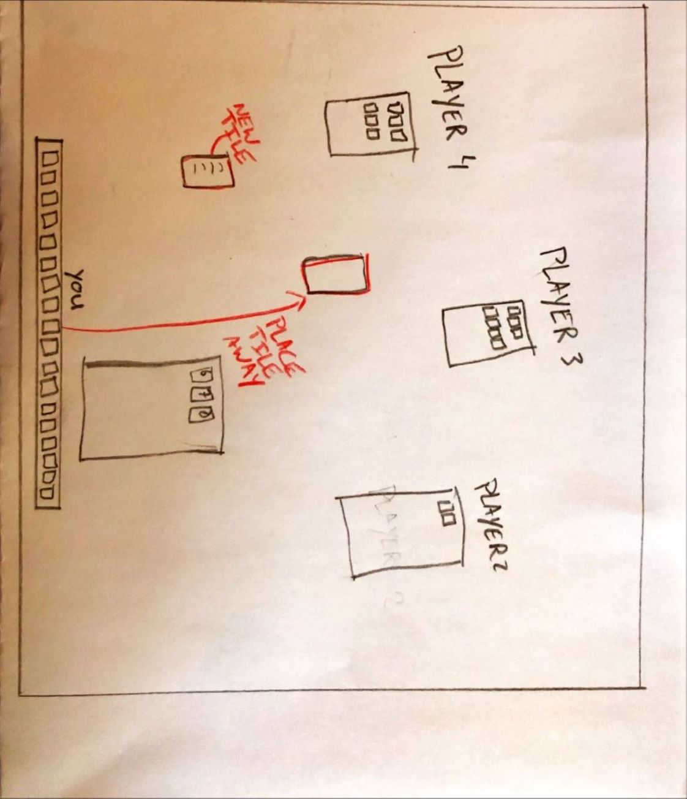
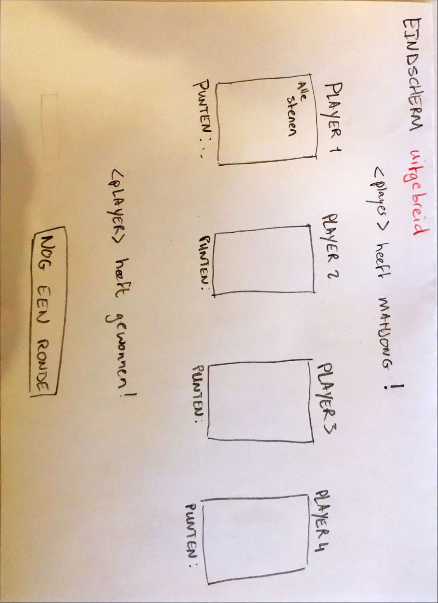
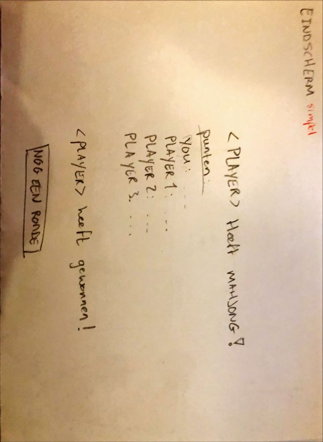

**Project: WebMahjong**  
Fee Elders

# vragen

1. wat is het probleem?
	Mahjong is een fysiek spel dat, voor zover ik weet, niet online bestaat. Er is een online versie van mahjong, maar dat is een soort memory, wat totaal niet lijkt op de "echte" mahjong. Er bestaat dus geen echt mahjong spel dat online gespeeld kan worden.
2. Wie zijn je verwachte gebruikers?
	Mahjongliefhebbers! En mijn vrienden en mijn gezin. We spelen vaak mahjong, maar het is pas echt leuk als je ook tussendoor een potje kan spelen, zonder altijd alle spullen mee te nemen
3. In welke setting wordt het gespeeld?
	Iedereen achter zijn eigen laptop. In het geval dat multiplayer niet werkt, wordt het op 1 laptop gespeeld.
4. Wat doet jouw oplossing anders?
	Het is de eerste versie van een spel dat nog niet online bestaat, maar wel fysiek wordt gespeeld door mensen. Deze oplossing focust op een simpele kleine implementatie, maar zorgt wel dat er later (misschien) een daadwerkelijk compleet mahjong spel gespeeld kan worden online.

# schets

Deze oplossing zal een beknopte simpele online versie van mahjong bieden.
In de schetsen heb ik voor sommige schermen twee alternatieven getekend, een versimpelde of een "ideale".

**Beginscherm** 

**spelopties**

**spelscherm uitgebreid**

**spelscherm versimpeld**

**eindscherm uitgebreid**

**eindscherm simpel**

# Features

### algemene lijst
- multi-player
- beginscherm
- uitlegscherm
- create game knop waarbij je
	- 4 namen van spelers kan invoeren
	- voor multiplayer: een game code krijgt die mensen kunnen joinen
		- join game functie
- "plankje" met je eigen stenen
- functie om stenen te verschuiven op je plankje
- knop om steen uit de muur te pakken (random steen)
- de optie om stenen van je bord af te leggen (weg te doen)
- een vierkant of rechthoek waar je je pungs, kongs en chows en bloemen kan plaatsen
	- met een knop om aan te geven dat een pung of kong in de hand is
- knop om "pung", "kong' of "chow" te roepen.
- eindscherm met puntentelling

### lijst met alleen musts
- plankje met eigen stenen
- knop om steen uit de muur te pakken (random steen)
- beginscherm
- uitlegscherm
- knop om een steen van je bord af te leggen (weg te doen)
- eindscherm met puntentelling

# requirements
- de stenen layout: https://www.etsy.com/nl/listing/1572216847/volledige-mahjong-patroon-svg?ga_order=most_relevant&ga_search_type=all&ga_view_type=gallery&ga_search_query=templates+mah+jongg&ref=sr_gallery-1-2&dd=1&content_source=238af8aeae35e8c8a9b56e78a9b3d0374ccdd7c2%253A1572216847&organic_search_click=1
- html canvas? 
- javascript events?
- socket voor multiplayer

# wat wordt moeilijk?
- De layout:
	Het gaat denk ik moeilijk worden om het spel er mooi uit te laten zien. Ik heb een variant uitgetekend die zeer minimalistisch is. 2D, geen mooie fratsen.
- Het spelbord:
	Ieder heeft zn eigen plankje met stenen. Stenen worden voortdurend weggelegd "uit het spel", of ergens anders neergelegd. Dit wordt denk ik lastig te realiseren, omdat je dan een speler een steen moet laten verslepen naar bepaalde plekken. Een uitweg hiervoor zou kunnen zijn om stenen die weggesleept moeten worden, gewoon weg te halen met een klik op een knop. Een onderdeel is dat je bepaalde combinaties aan stenen versleept naar naast je plankje, dit element zou ik eventueel kunnen skippen (als het noodzakelijk is).
- Interactie tussen spelers:
	het spel heeft interactieve elementen, waardoor de "normale" volgorde van spelers kan worden onderbroken als iemand bijvoorbeeld op een knop drukt. Dit soort interactie wordt denk ik lastig, maar is wel redelijk belangrijk.
- Multiplayer:
	Ik kan niet zo goed inschatten hoe lastig het is om het spel multiplayer te maken, maar in het geval dat dat niet lukt, kan ik een variant maken die single-player is, hoe saai dat dan ook maar wordt